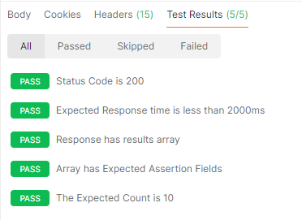

# SQATest
This is a repo for my submission for the QA Assistant Manager role at I&amp;M Bank
## Section 1: API Testing
Test Cases:
1. TC01 - Test Case 1 - Valid Request (Positive Test Case)
Steps
Send a GET request to the base API

Expected Results:
Status Code is 200 - Success/Okay
Response is Not Null and has an array body
The Results array body has details such as gender, name, location, email, login, dob, etc

2. TC02 - Test Case 2 - Get 10 Users (Positive Test Case)
Steps
Modify the endpoint and add /?results=10 to the request. This prompts the API to send multiple responses in one request as per the number specified in the request.

Expected Results:
Status Code is 200 - Success/Okay
The response array has 10 requests grouped into one response

3. TC03 - Test Case 3 - Invalid Endpoint (Negative Test Case)
Steps 
Modify the endpoint and add /invalid to the request. The /invalid path does not exist on the API.

Expected Result 
Status Code is 404 - Not Found 

4. TC04 - Test Case 4 - Filter Results by Parameter (Edge Case)
Steps
Invoke a request with /?gender=female to specify the expected result to only highlight female gender. 

Expected Result
The API response will only return female users

5. TC05 - Test Case 5 - Handling a Large Number of Results (Edge Case)
Modify the endpoint and add /?results=5000 to the request. This prompts the API to send multiple responses in one request as per the number specified in the request.
However, the request reverts to a single response when the 5000 limit is reached.

Expected Result 
The API will return a maximum of 5000 results. This was tested by identifying a unique keyword such as "login" from the responses to validate the number of times it appeared in the results.
The API will return a default response when the threshold is passed. When the parameter /?results=5000 was adjusted to be greated than 5001, the API returned single results.

6. TC06 - Test Case 6 - Zero Results (Edge Case)
Steps 
Modify the request to /?results=0

Expected Results
The API will return a Status 200 
The API should return an empty string
The API will return a default response 

Expected Status Codes for the Collection
200  Success - This is the expected outcome when a request is successfully sent 
404  Not found - This is the expected outcome when a resource is not found 
500  Server error - This is the response sent when the server is not reachable/responsive and the request is not delivered to the specified endpoint 

Validation Points 
Response schema (JSON structure)
Field presence (name, email, etc.)
Data types (string, array)
Response time (< 2s ideally)

### Postman  Automation Script 
// Function to Check Expected Status Code
pm.test(" Status Code is 200", function () {
    pm.response.to.have.status(200);
});

// Function to Check Expected Response Time
pm.test("Expected Response time is less than 2000ms", function () {
    pm.expect(pm.response.responseTime).to.be.below(2000);
});

// Function to Check Expected JSON Structure
pm.test("Response has results array", function () {
    const jsonData = pm.response.json();
    pm.expect(jsonData).to.have.property("results");
});

// Validate Additional Fields in the Returned Response 
pm.test("Array has Expected Assertion Fields", function () {
    const user = pm.response.json().results[0];
    pm.expect(user).to.have.property("email");
    pm.expect(user).to.have.property("name");
    pm.expect(user).to.have.property("login");
});

// Function to Validate Specified Number of Users
pm.test("The Expected Count is 10", function () {
    const jsonData = pm.response.json();
    pm.expect(jsonData.results.length).to.eql(10);
});

## Section 2 - Coding Task 
The Python file has been attached in this repo -- emailvalidation.py

## Section 3 - UI Testing 
# Functional Test Cases
- Valid Login -- Enter correct email/password combination for a successful login
- Email field validation -- Enter valid email format to proceed to login 
- Password field input -- Enter correct password for the email provided for a successful login
- Login button click -- Button triggers authentication when the email/password fields are populated 
- Navigation after login -- User redirected to dashboard or homepage after successful login attempt

# Negative Test Cases 
- Invalid Email Format -- Error message displayed specifying that the email format is incorrect 
- Empty fields -- Validation messages shown to prompt for input in the highlighted fields 
- Wrong credentials -- Invalid Credentials error prompting the user to check their input and try again 

# Possible Bugs
- Login button not responsive
- No validation for empty fields
- Incorrect error messages
- Password visible (not masked)
- No rate limiting on login attempts

## Section 4 - Bug Report 

✅ SECTION 4: BUG REPORT
Title:

Login button does not respond after entering valid credentials

Severity:

Critical

Priority:

High

Environment:
Browser: Chrome
OS: Windows/Android
Steps to Reproduce:
Open login page
Enter valid email
Enter valid password
Click login
Expected Result:

User should be logged in and redirected to dashboard

Actual Result:

Nothing happens after clicking login

Attachments:

(Screenshots/logs if available)

✅ SECTION 5: SIT TESTING
🔍 How to Investigate
Reproduce the issue
Trace transaction flow end-to-end
Check if API call succeeded
Verify if request reached core banking
🔧 Systems & Logs to Check
1. Mobile App Logs
UI success trigger
API response received
2. API Gateway Logs
Request/response payload
Status codes
3. Middleware / ESB
Message transformation
Queue status
4. Core Banking System
Transaction logs
Debit processing
5. Database
Transaction records
Status mismatch
6. Message Queues (Kafka/RabbitMQ)
Failed or stuck messages
🎯 Likely Root Causes
UI showing success prematurely
API success but backend failure
Message not reaching core banking
Timeout or async failure
